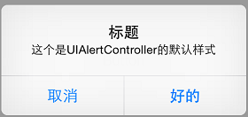
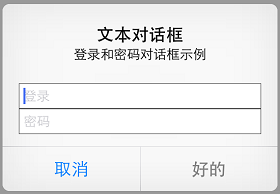
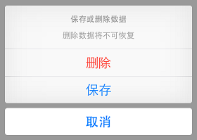

# UIAlertControllerDemo

##笔记
### 创建UIAlertController

```Swift
convenience init(title title: String?,
         		message message: String?,
				preferredStyle preferredStyle: UIAlertControllerStyle)
```

> 举例：

    let alertController = UIAlertController(title: "标题",
                                            message: "这是一条弹出消息",
                                            preferredStyle: UIAlertControllerStyle.Alert)


### UIAlertController的样式

```Swift
enum UIAlertControllerStyle : Int {
    case ActionSheet
    case Alert
}
```

> 举例：

Alert的样式

 Alert样式1

 Alert样式2

ActionSheet的样式



### UIAlertAction

```Swift
convenience init(title: String?, 
					style: UIAlertActionStyle, 
					handler: ((UIAlertAction) -> Void)?)
```

> 举例：

    let okAction = UIAlertAction(title: "确认", style: .Default) { (action:UIAlertAction) -> Void in
        print("点击确认")
    }

将UIAlertAction添加到UIAlterController上

```Swift
func addAction(_ action: UIAlertAction)
```

> 举例：

	alertController.addAction(okAction)


### Alert中的UITextField

例如Alert样式2中看到的编辑框UITextField

```Swift
func addTextFieldWithConfigurationHandler(_ configurationHandler: ((UITextField) -> Void)?)
```
> 举例：

    alertController.addTextFieldWithConfigurationHandler { (textField:UITextField) -> Void in
        textField.placeholder = "Password"
        textField.secureTextEntry = true
    }

##相关资料链接：

[官方文档](https://developer.apple.com/library/tvos/documentation/UIKit/Reference/UIAlertController_class/)

[在iOS 8中使用UIAlertController](http://www.cocoachina.com/ios/20141126/10320.html)


