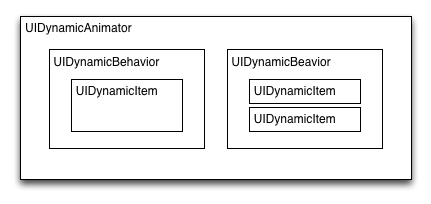

# DynamicsDemo

[UIKit Dynamics Tutorial: Getting Started](http://www.raywenderlich.com/76147/uikit-dynamics-tutorial-swift)

##笔记
### 什么是UIKit Dynamics？
UIkit Dynamics简单来说是在UIkit中的物理2D引擎。

### UIKit Dynamics能做什么？
UIKit Dynamics可以模拟真实的物理动画，例如：重力，拖拽，碰撞，悬挂等动画效果。

### UIKit Dynamics怎么玩？

先说一下UIDynamicAnimator，可以比成一个真实的垂直画板,我们可以在上面模拟不同的物理行为。

	var animator: UIDynamicAnimator!
	
	animator = UIDynamicAnimator(referenceView: view)

先玩下重力效果：

	var square : UIView!
	
	var animator: UIDynamicAnimator!
	
	var gravity: UIGravityBehavior!
	
	square = UIView(frame: CGRect(x: 100, y: 100, width: 100, height: 100))
	
	square.backgroundColor = UIColor.grayColor()
	
	view.addSubview(square);  
	        
	animator = UIDynamicAnimator(referenceView: view);
	
	gravity = UIGravityBehavior(items: [square]);
	
	animator.addBehavior(gravity);
	

产生的效果：

还有其他物理行为：

UIGravityBehavior：重力行为

UICollisionBehavior：碰撞行为

UISnapBehavior：捕捉行为

UIPushBehavior：推动行为

UIAttachmentBehavior：附着行为

UIDynamicItemBehavior：动力元素行为

### 怎么玩好UIKit Dynamics？

首先我们来看这个图

UIDynamicAnimator提供了坐标系

UIDynamicBehavior是所有物理行为的基类

UIDynamicItem产生物理行为的对象

***

UIDynamicAnimator is associated with a reference view that provides the coordinate system. You then add one or more behaviors that exert forces on the items they are associated with. Most behaviors can be associated with multiple items, and each item can be associated with multiple behaviors. 

Neither of the behaviors in your current code is “aware” of the barrier, so as far as the underling dynamics engine is concerned, the barrier doesn’t even exist

>一句话概述：dynamics only affect views that have been associated with behaviors.

***

##相关资料链接：

[iOS 7 UIKit Dynamic 学习总结](http://vit0.com/blog/2014/03/08/ios-7-uikit-dynamic-xue-xi-zong-jie/)

[iOS7 Day-by-Day :: Day 0 :: UIKit Dynamics](https://www.shinobicontrols.com/blog/ios7-day-by-day-day-0-uikit-dynamics)

[Introduction to UIKit Dynamics](http://www.teehanlax.com/blog/introduction-to-uikit-dynamics/)

[UIDynamics in Swift](https://www.bignerdranch.com/blog/uidynamics-in-swift/)

